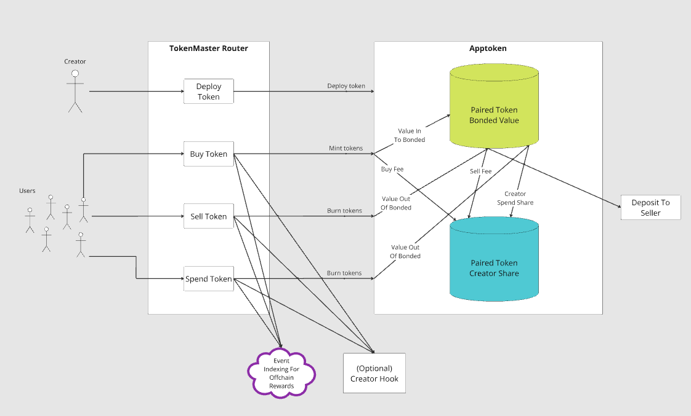
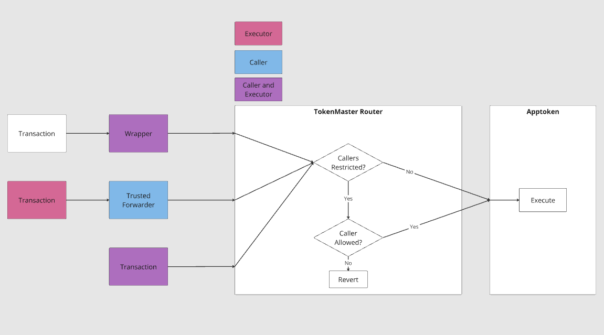
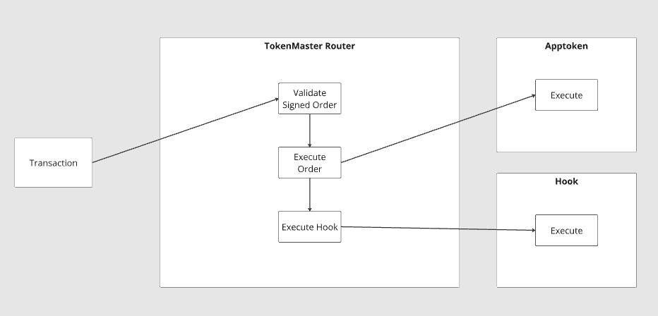
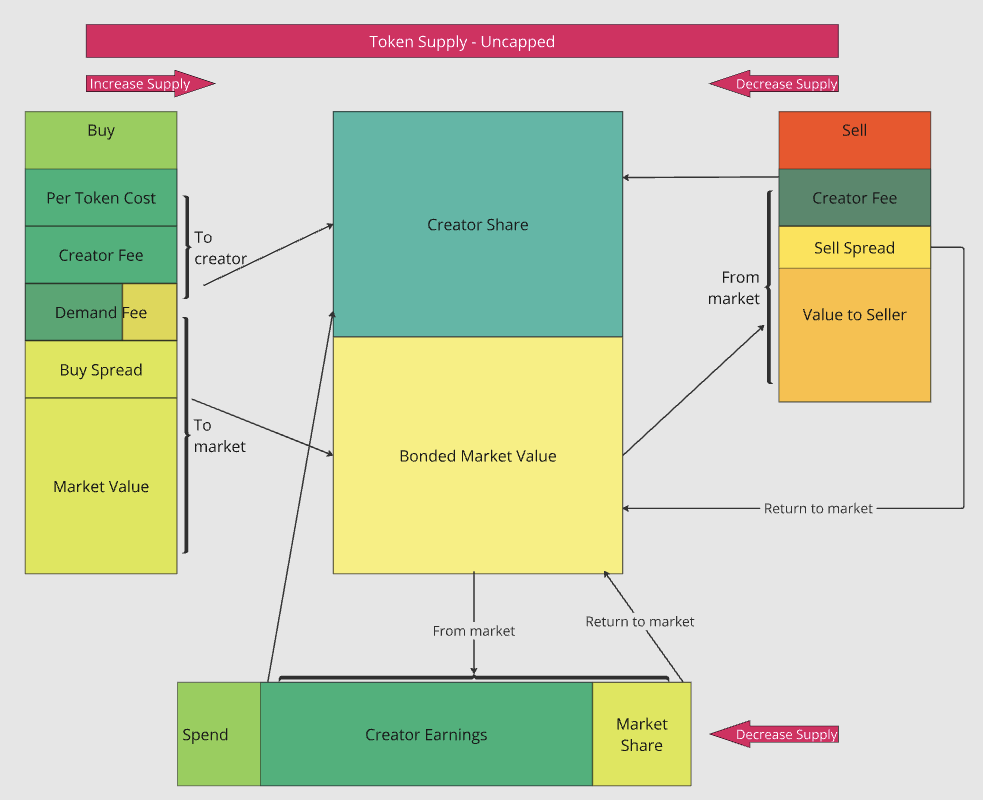
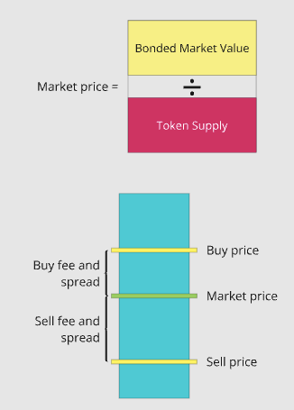
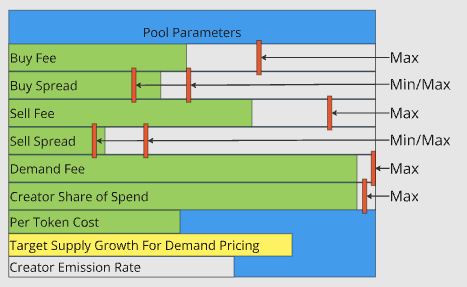
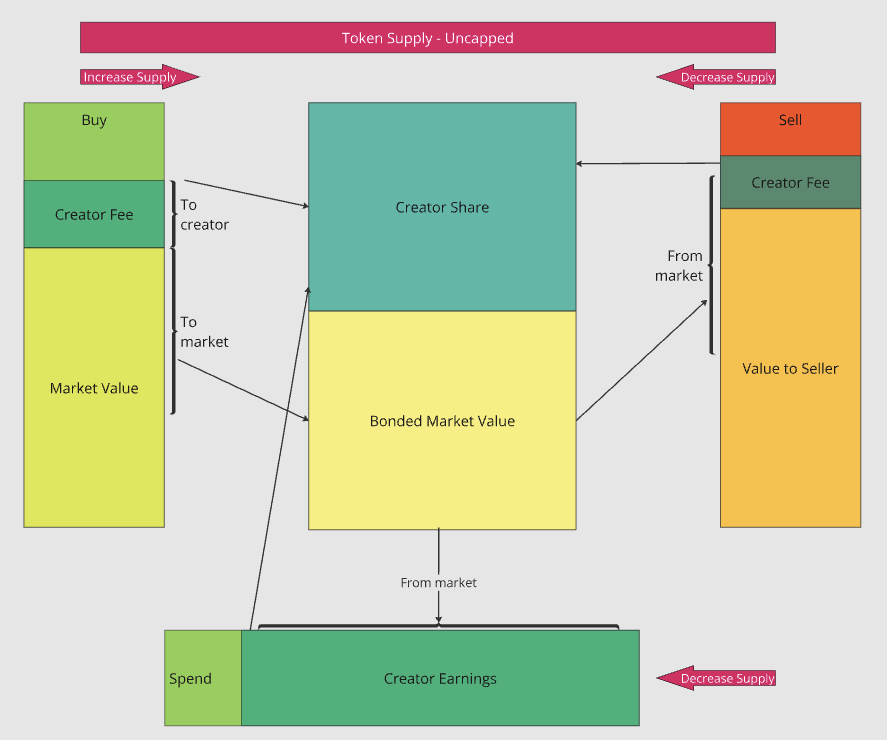
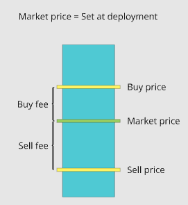
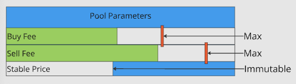

TokenMaster
==============

# Introduction
TokenMaster is a next-generation fungible token protocol optimized for onchain consumer economies. Built on the advanced ERC20-C standard, TokenMaster enables the creation of highly customizable tokens tailored for diverse applications. Tokens launched via TokenMaster are paired with an existing token (e.g., the chain's native token or another ERC20), functioning as both a pool and a token. Creators can select from multiple pool types to tailor the behavior of their token to their application's needs.

# Table of Contents

1. **[Introduction](#introduction)**
2. **[Features](#features)**
3. **[Benefits](#benefits)**
4. **[Definitions](#definitions)**
5. **[Contract Addresses](#contract-addresses)**
6. **[TokenMaster Router](#tokenmaster-router)**
   - [Transaction Flow](#transaction-flow)
   - [Token Deployment Flow](#token-deployment-flow)
   - **[Transactions](#transactions)**
     - [Buy Transaction Flow](#buy-transaction-flow)
     - [Sell Transaction Flow](#sell-transaction-flow)
     - [Spend Transaction Flow](#spend-transaction-flow)
   - **[Advanced Order Signing](#advanced-order-signing)**
     - [Cosigning](#cosigning)
     - [Permit Transfer](#permit-transfer)
   - **[Hooks](#hooks)**
   - **[Oracles](#oracles)**
   - **[Data Types](#data-types)**
     - [DeploymentParameters](#deploymentparameters)
     - [PoolDeploymentParameters](#pooldeploymentparameters)
     - [BuyOrder](#buyorder)
     - [PermitTransfer](#permittransfer)
     - [SellOrder](#sellorder)
     - [SpendOrder](#spendorder)
     - [SignedOrder](#signedorder)
     - [SignatureECDSA](#signatureecdsa)
     - [Cosignature](#cosignature)
   - **[Functions](#functions)**
     - [Order Functions](#order-functions)
     - [Token Deployment / Settings Functions](#token-deployment--settings-functions)
     - [Creator / Partner / Infrastructure Functions](#creator--partner--infrastructure-functions)
     - [Administrative Functions](#administrative-functions)
   - **[Events](#events)**
     - [Administrative Events](#administrative-events)
     - [Token Configuration Events](#token-configuration-events)
     - [Order Fill Events](#order-fill-events)
     - [Order Configuration Events](#order-configuration-events)
7. **[TokenMaster Pools](#tokenmaster-pools)**
   - [Common Pool Functionality](#common-pool-functionality)
   - [ERC-165 Interfaces](#erc-165-interfaces)
8. **[Standard Pool](#standard-pool)**
   - [Flow of Funds](#flow-of-funds)
   - [Standard Pool Settings](#standard-pool-settings)
   - [Transactions](#transactions)
     - [Buy](#buy)
     - [Sell](#sell)
     - [Spend](#spend)
     - [Claim Emissions](#claim-emissions)
   - [Data Types](#data-types-1)
     - [StandardPoolInitializationParameters](#standardpoolinitializationparameters)
     - [StandardPoolBuyParameters](#standardpoolbuyparameters)
     - [StandardPoolSellParameters](#standardpoolsellparameters)
     - [StandardPoolSpendParameters](#standardpoolspendparameters)
   - [Standard Pool Functions](#standard-pool-functions)
   - [Standard Pool Events](#standard-pool-events)
9. **[Stable Pool](#stable-pool)**
   - [Flow of Funds](#flow-of-funds-1)
   - [Stable Pool Settings](#stable-pool-settings)
   - [Transactions](#transactions-1)
     - [Buy](#buy-1)
     - [Sell](#sell-1)
     - [Spend](#spend-1)
   - [Data Types](#data-types-2)
     - [StablePoolInitializationParameters](#stablepoolinitializationparameters)
     - [StablePoolBuyParameters](#stablepoolbuyparameters)
     - [StablePoolSellParameters](#stablepoolsellparameters)
     - [PairedPricePerToken](#pairedpricepertoken)
   - [Stable Pool Functions](#stable-pool-functions)
   - [Stable Pool Events](#stable-pool-events)
10. **[Promotional Pool](#promotional-pool)**
   - [Promotional Pool Settings](#promotional-pool-settings)
   - [Transactions](#transactions-2)
     - [Buy](#buy-2)
     - [Sell](#sell-2)
     - [Spend](#spend-2)
   - [Data Types](#data-types-3)
     - [PromotionalPoolInitializationParameters](#promotionalpoolinitializationparameters)
     - [PromotionalPoolBuyParameters](#promotionalpoolbuyparameters)
   - [Promotional Pool Functions](#promotional-pool-functions)
   - [Promotional Pool Events](#promotional-pool-events)


# Features:
- **Token Deployment:** Deploy ERC20-C tokens paired with an existing token to establish market value.
- **Flexible Transactions:** Enable buy, sell, and ***spend*** operations with robust event hooks for seamless integration across onchain and offchain systems.
- **Creator Empowerment:** Fine-grained creator controls to define tokenomics and ecosystem behavior, free from external constraints.
- **User Safety:** Built-in guardrails to ensure secure and user-friendly token interactions.
- **Future-Ready Architecture:** Modular and extensible design, enabling new token mechanics and protocol wrapping for enhanced customizability.

# Benefits: 
* Near-zero cost to bootstrap a token.
* Tokens scale to market demand without artificial limitations.
* Multiple sources of revenue for creators while maintaining price stability.

# Definitions
- **Apptoken:** - A programmable token created for use within a specific application or ecosystem.
- **Advanced Order:** - A signed instruction enabling advanced buy, sell, or spend transactions. These orders allow creators to integrate onchain hooks and optional offchain actions seamlessly.
- **Cosigner**: An optional signer in advanced orders that adds an additional layer of permissioning, allowing creators to restrict execution to specific executors.
- **Hook Extra Data**: Arbitrary bytes data passed to hooks during transactions, allowing for custom logic execution tailored to specific use cases.
- **Oracle Extra Data**: Arbitrary bytes data passed to oracles during transactions, providing context or parameters for dynamic value adjustments.
- **Pairing Restrictions**: Rules defined by the creator to control which tokens can be paired with a TokenMaster token, ensuring compatibility and avoiding unintentional pairings.
- **PermitC**: A permit-based system allowing token transfers using advanced logic for expiration and bulk cancellation of open approvals, leveraging EIP-712 signatures for secure and efficient interactions.
- **TokenMaster Router:** The core contract that facilitates token deployment, enforces pairing rules, processes transactions (including advanced orders), and triggers onchain hooks for extended functionality.
- **Trusted Channels:** - Pre-approved addresses authorized to initiate transactions through the TokenMaster Router for specific tokens.

# Contract Addresses

TokenMaster contracts are deployed at the following addresses across EVM-compatible blockchains:

| Contract                              | Address                                      |
| ------------------------------------- | -------------------------------------------- |
| **TokenMaster Router**                | `0x0E00009d00d1000069ed00A908e00081F5006008` |
| **Standard Pool Factory**             | `0x000000c5F2DF717F497BeAcCE161F8b042310d17` |
| **Stable Pool Factory**               | `0x0000006a50a9c9Efae8875266ff222579fC2F449` |
| **Promotional Pool Factory**          | `0x00000014D04B7d1Cad1960eA8980A9af5De2104e` |

### Deploying the Infrastructure

For EVM-compatible blockchains where the TokenMaster protocol is not currently deployed, users can deploy it using the [Limit Break Infrastructure Deployment Tool](https://developers.erc721c.com/infrastructure).

# TokenMaster Router
TokenMaster Router serves as the primary hub for all TokenMaster transactions allowing creators to control all aspects of their token lifecycle.

Transaction diagram of the relationship between TokenMaster Router and a typical token pool. 


TokenMaster Router implements the Limit Break TrustedForwarder system to allow creators and protocol integrators to route transactions through an external entry point, that may be permissioned with a signing authority for offchain authorization, as well as a `Trusted Channels` list that restricts the caller address to being in a list specified by the creator. `Trusted Channels` may be used to require a specific TrustedForwarder or a custom wrapper that adds logic to TokenMaster transactions.


## Token Deployment Flow

TokenMaster allows creators to deploy tokens with precise configurations tailored to their application's needs. The deployment process involves selecting the desired token type, configuring deployment parameters, and leveraging deterministic address computation for predictability.

### Steps to Deploy a Token

1. **Choose Token Type**:
   - Decide the type of pool (e.g., Standard, Stable, Promotional) that best suits your application's requirements.

2. **Construct Deployment Parameters**:
   - Use the following key structures to define the token's behavior and settings:
     - [**DeploymentParameters**](#deploymentparameters): General deployment settings such as the token factory, deterministic address salt, and transaction rules.
     - [**PoolDeploymentParameters**](#pooldeploymentparameters): Pool-specific settings, including token metadata, pairing token, and initial supply.

3. **Compute the Deterministic Deployment Address**:
   - Use the factory contract's helper function `computeDeploymentAddress` to calculate the token's address before deployment:
     ```solidity
     function computeDeploymentAddress(
         bytes32 tokenSalt,
         PoolDeploymentParameters calldata poolParams,
         uint256 pairedValueIn,
         uint256 infrastructureFeeBPS
     ) external view returns(address deploymentAddress);
     ```
   - This ensures predictability and prevents address conflicts.

4. **Deploy the Token**:
   - Call the `deployToken` function on the TokenMaster Router with the constructed parameters:
     ```solidity
     function deployToken(
         DeploymentParameters calldata deploymentParameters,
         SignatureECDSA calldata signature
     ) external payable;
     ```
Note: The `signature` parameter is only required when TokenMaster Router has a signing authority enabled for token deployments. If a signing authority is not configured, the `signature` parameter is validated. 

5. **Token Activation**:
   - Upon successful deployment, the token will be fully operational and managed via the TokenMaster Router.

## Transactions

### Buy Transaction Flow
1. **Specify Purchase Amount**: The buyer inputs the desired number of tokens.  
2. **Calculate Cost**: The platform computes the expected cost in the paired token, accounting for slippage (refer to [TokenMaster Pools](#tokenmaster-pools) for cost calculations by pool type).  
3. **Approval Handling (ERC20)**:
   - **Using PermitC**:
     1. Verify user’s token approval for PermitC. If insufficient, prompt an approval transaction.
     2. Generate a signed PermitC transfer order. See [PermitTransfer](#permit-transfer).
   - **Using Direct Approvals**:
     - Verify user’s token approval for TokenMaster Router. If insufficient, prompt an approval transaction.
4. **Cosignature (Optional)**: Obtain cosignature if required by the advanced order. See [Cosigning](#cosigning).
5. **Transaction Execution**:
   - **Advanced Buy Or PermitC Orders**:
     - Call `buyTokensAdvanced` with the required parameters ([BuyOrder](#buyorder), [SignedOrder](#signedorder), and [PermitTransfer](#permittransfer)).
       - Set `signedOrder.hook` to `address(0)` for basic orders.
       - Set `permitTransfer.permitProcessor` to `address(0)` for direct approvals.
   - **Basic Buy Orders**:
     - Call `buyTokens` with the [BuyOrder](#buyorder).
   - **Native Token Pairing**:
     - Include the native token value as `msg.value` when invoking the router.

### Sell Transaction Flow
1. **Specify Sale Amount**: The user inputs the desired number of tokens to sell.
2. **Calculate Expected Value**: The platform computes the expected value in the paired token, accounting for slippage (refer to [TokenMaster Pools](#tokenmaster-pools) for sell value calculations by pool type).
3. **Cosignature (Optional)**: Obtain cosignature if the advanced order requires it. See [Cosigning](#cosigning).
4. **Transaction Execution**:
   - **Advanced Sell Orders**:
     - Call `sellTokensAdvanced` with the [SellOrder](#sellorder) and [SignedOrder](#signedorder).
   - **Basic Sell Orders**:
     - Call `sellTokens` with the [SellOrder](#sellorder).

### Spend Transaction Flow

1. **Select Spend Order**: The user selects a signed spend order to execute.  
2. **Specify Multiples**: The user inputs the number of multiples of the spend order to execute.  
3. **Calculate Maximum Spend**: The platform determines the maximum spend amount based on the signed spend order and the specified multiples, adjusting for value and slippage if an oracle price adjustment is involved.  
4. **Cosignature (Optional)**: Obtain cosignature if the advanced order requires it. See [Cosigning](#cosigning).
5. **Transaction Execution**:
   - Call `spendTokens` with the [SpendOrder](#spendorder) and [SignedOrder](#signedorder).


#### Example Use Cases
* A game developer could use spends to sell items and lives to players using event indexing to issue the items offchain.
* A project could use spends with onchain hooks to mint NFTs using their ecosystem apptoken.
* A retail point of sale system could generate signed orders for the customer to pay onchain using the store's token.

## Advanced Order Signing
TokenMaster enables creators to enhance user interactions by supporting optional signed advanced orders for buy and sell transactions in addition to spend orders. These advanced orders allow creators to integrate onchain [hooks](#hooks) and provide incentives or custom logic.

### Features of Advanced Orders:
- **Custom Incentives**: Creators can reward buyers and sellers through advanced order mechanisms.
- **Spend Transactions**: Require signed orders but allow hooks to be optional. Offchain monitoring of the [SpendOrderFilled](#order-fill-events) event can substitute for hooks.

Advanced Buy Order EIP-712 Primary Message Type: 
`BuyTokenMasterToken(bytes32 creatorBuyIdentifier,address tokenMasterToken,address tokenMasterOracle,address baseToken,uint256 baseValue,uint256 maxPerWallet,uint256 maxTotal,uint256 expiration,address hook,address cosigner)`

Advanced Sell Order EIP-712 Primary Message Type:
`SellTokenMasterToken(bytes32 creatorSellIdentifier,address tokenMasterToken,address tokenMasterOracle,address baseToken,uint256 baseValue,uint256 maxPerWallet,uint256 maxTotal,uint256 expiration,address hook,address cosigner)`

Spend Order EIP-712 Primary Message Type:
`SpendTokenMasterToken(bytes32 creatorSpendIdentifier,address tokenMasterToken,address tokenMasterOracle,address baseToken,uint256 baseValue,uint256 maxPerWallet,uint256 maxTotal,uint256 expiration,address hook,address cosigner)`

* `creator*Identifier` is a value specified by the creator to identify the order during onchain hook execution or for offchain processing.
* `tokenMasterOracle` must be set to the zero address if not using an oracle to adjust `baseValue`.
* `baseToken` is only applicable to orders that are using an oracle to adjust the `baseValue`.
* `baseValue` is the amount of token value required to execute the order.
* `maxPerWallet` is the maximum amount that one wallet can execute against the specific signed order (Note for clarity: a specific signed order encompasses all fields in the message type, not just the creator identifier). For spends this amount is specified in multiples, for buys and sells this amount is specified in tokens.
* `maxTotal` is the maximum amount that all wallets can execute against the specific signed order (Note for clarity: a specific signed order encompasses all fields in the message type, not just the creator identifier). For spends this amount is specified in multiples, for buys and sells this amount is specified in tokens.
* `expiration` is the Unix timestamp after which the signed order is invalid.
* `hook` is the onchain hook to call after the buy/sell/spend is executed. A hook is required for buy and sell advanced orders but optional for spends.
* `cosigner` is the address of the cosigner for the signed order (see [Cosigning](#cosigning)).

### EIP-712 Signature Requirements:
- Advanced orders must be signed by an authorized account designated on the TokenMaster Router through the [setOrderSigner](#token-deployment--settings-functions) function.
- **Domain Separator**:  
  - **Name**: `TokenMasterRouter`  
  - **Version**: `1`  
  - **Chain ID**: The chain where the order is executed.  
  - **Verifying Contract**: Address of TokenMaster Router.  

Refer to the [SignedOrder](#signedorder) struct for formatting advanced order parameters and signatures.

### Cosigning

Advanced orders can include an optional cosigner to add an extra layer of permissioning. Cosigners enable creators to enforce execution restrictions, such as limiting specific transactions to authorized executors.

#### Key Features:
- **Permissioning**: Restrict advanced orders to pre-approved executors.
- **EIP-712 Cosignature**:  
  - Cosignatures include the `v`, `r`, and `s` components of the signed advanced order.  
  - These must match the cosigner specified in the [Cosignature](#cosignature) struct.

#### Cosignature Format:
Cosignature EIP-712 Primary Message Type:
```solidity
Cosignature(uint8 v, bytes32 r, bytes32 s, uint256 expiration, address executor)
```

#### Developer Notes:
- Cosigner addresses are not permissioned on TokenMaster Router the only requirement is that when a non-zero cosigner address is specified in the [Cosignature](#cosignature) struct the cosignature's signature recovers to that address.

#### Example Use Cases: 
- Require a transaction is originating from within a creator's application.
- Require a user has completed certain actions prior to executing a transaction.

### Permit Transfer

TokenMaster supports PermitC permit transfers for paired tokens when buying TokenMaster tokens. To execute a permit transfer the platform *must* get a signed permit from the user and ensure the PermitC contract being utilized has sufficient allowance from the user for the token being permitted.

The domain separator for the permit will be the domain separator of the PermitC contract being utilized.

Permit Transfer EIP-712 Primary Message Type: 
`PermitTransferFromWithAdditionalData(uint256 tokenType,address token,uint256 id,uint256 amount,uint256 nonce,address operator,uint256 expiration,uint256 masterNonce,AdvancedBuyOrder advancedBuyOrder)AdvancedBuyOrder(address tokenMasterToken,uint256 tokensToBuy,uint256 pairedValueIn,bytes32 creatorBuyIdentifier,address hook,uint8 buyOrderSignatureV,bytes32 buyOrderSignatureR,bytes32 buyOrderSignatureS)`

## Hooks

Hooks are custom smart contracts that execute additional onchain actions after advanced orders are processed. Creators can deploy hooks to extend functionality and integrate with their ecosystem.

### Supported Hook Types:
1. **Buy Order Hooks**: Triggered after advanced buy orders.  
   - **Implementation Requirement**: Must implement [ITokenMasterBuyHook](./lib/tm-tokenmaster/src/interfaces/ITokenMasterBuyHook.sol).
2. **Sell Order Hooks**: Triggered after advanced sell orders.  
   - **Implementation Requirement**: Must implement [ITokenMasterSellHook](./lib/tm-tokenmaster/src/interfaces/ITokenMasterSellHook.sol).
3. **Spend Order Hooks**: Triggered after spend orders.  
   - **Implementation Requirement**: Must implement [ITokenMasterSpendHook](./lib/tm-tokenmaster/src/interfaces/ITokenMasterSpendHook.sol).

### Key Parameters:
- **Transaction Context**: Hooks receive details such as token being transacted, executor address, creator identifier, and quantity transacted. Quantity transacted is amount of token for buy and sells, multiples for spends.

### Hook Design Notes:
- **Validation**: Hook contracts must validate the caller as the TokenMaster Router and confirm the token involved is valid for the hook's logic.
- **Extra Data**: Hooks can receive additional contextual data through the `extraData` parameter for custom use cases. Validation of this data is the responsibility of the hook logic.



## Oracles

Oracles in TokenMaster allow dynamic adjustment of transaction values by referencing external data, such as market conditions or token price feeds. They enable greater flexibility in token mechanics and creator-defined customizations.

### Key Features:
- **Dynamic Adjustments**: Modify transaction requirements (e.g., token value or spend amount) based on external inputs.
- **Transaction Types Supported**:  
  - **Buy Orders**: Specify the minimum required paired token value for token purchases.  
  - **Sell Orders**: Determine the paired token value received for token sales.  
  - **Spend Orders**: Define the per-multiple spend amount in paired tokens.

### Oracle Parameters and Flow:
#### Key Parameters:
- **Base Value**: The required token value for the transaction. If no oracle is used, `tokenMasterOracle` is set to `address(0)` in the `SignedOrder`.
- **Extra Data**: Optional additional information passed to the oracle via the `extraData` field for advanced logic.

#### Transaction Type Values:
| Transaction | Type Value |
| ----------- | ---------- |
| Buy         | `0`        |
| Sell        | `1`        |
| Spend       | `2`        |

### Example Use Cases:
1. **Price Pegging**: Use oracles to dynamically adjust token requirements to maintain a stable price (e.g., pegged to a stablecoin).  
2. **Discounts and Promotions**: Apply promotional rates or discounts by dynamically altering the required token value based on demand or time-limited campaigns.

### Developer Notes:
- **Data Decoding**: Decoding and validating the `extraData` field is the responsibility of the oracle logic.  


## Data Types

### DeploymentParameters
This struct defines parameters used by the TokenMasterRouter and factories for deploying tokens.
- **tokenFactory**: The token factory to use to deploy a specific pool type.
- **tokenSalt**: The salt value to use when deploying the token to control the deterministic address.
- **tokenAddress**: The deterministic address of the token that will be deployed.
- **blockTransactionsFromUntrustedChannels**: Initial setting for blocking transactions from untrusted channels.
- **restrictPairingToLists**: Initial setting for restricting pairing of the new token with other tokens.
- **poolParams**: The parameters that will be sent during token contract construction.
- **maxInfrastructureFeeBPS**: The maximum infrastructure fee that is allowed without reverting the deployment.
```solidity
struct DeploymentParameters {
    address tokenFactory;
    bytes32 tokenSalt;
    address tokenAddress;
    bool blockTransactionsFromUntrustedChannels;
    bool restrictPairingToLists;
    PoolDeploymentParameters poolParams;
    uint16 maxInfrastructureFeeBPS;
}
```

### PoolDeploymentParameters
This struct defines parameters that are sent by token factories to create a token contract.

- **name**: The name of the token.
- **symbol**: The symbol of the token.
- **decimals**: The number of decimals of the token.
- **initialOwner**: Address to set as the initial owner of the token.
- **pairedToken**: Address of the token to pair with the new token, for native token use `address(0)`.
- **initialPairedTokenToDeposit**: Amount of paired token to deposit to the new token pool.
- **encodedInitializationArgs**: Bytes array of ABI encoded initialization arguments to allow new pool types with different types of constructor arguments that are decoded during deployment.
- **defaultTransferValidator**: Address of the initial transfer validator for a token.
- **useRouterForPairedTransfers**: If true, the pool will default to allowing the router to transfer paired tokens during operations that require the paired token to transfer from the pool. This is useful when pairing with ERC20C tokens that utilize the default operator whitelist which includes the TokenMasterRouter but does not include individual token pools.
- **partnerFeeRecipient**: The address that will receive partner fee shares.
- **partnerFeeBPS**: The fee rate in BPS for partner fees.

```solidity
struct PoolDeploymentParameters {
    string name;
    string symbol;
    uint8 tokenDecimals;
    address initialOwner;
    address pairedToken;
    uint256 initialPairedTokenToDeposit;
    bytes encodedInitializationArgs;
    address defaultTransferValidator;
    bool useRouterForPairedTransfers;
    address partnerFeeRecipient;
    uint256 partnerFeeBPS;
}
```

### BuyOrder
This struct defines buy order base parameters.

- **tokenMasterToken**: The address of the TokenMaster token to buy.
- **tokensToBuy**: The amount of tokens to buy.
- **pairedValueIn**: The amount of paired tokens to transfer in to the token contract for the purchase.
```solidity
struct BuyOrder {
    address tokenMasterToken;
    uint256 tokensToBuy;
    uint256 pairedValueIn;
}
```

### PermitTransfer
This struct defines a permit transfer parameters used in advanced buy orders that utilize PermitC advanced permit transfer functionality.

- **permitProcessor**: The address of the PermitC-compliant permit processor to use for the transfer.
- **nonce**: The permit nonce to use for the permit transfer signature validation.
- **permitAmount**: The amount that the permit was signed for.
- **expiration**: The time, in seconds since the Unix epoch, that the permit will expire.
- **signedPermit**: The permit signature bytes authorizing the transfer.
```solidity
struct PermitTransfer {
    address permitProcessor;
    uint256 nonce;
    uint256 permitAmount;
    uint256 expiration;
    bytes signedPermit;
}
```

### SellOrder
This struct defines sell order base parameters.

- **tokenMasterToken**: The address of the TokenMaster token to sell.
- **tokensToSell**: The amount of tokens to sell.
- **minimumOut**: The minimum output of paired tokens to be received by the seller without the transaction reverting.

```solidity
struct SellOrder {
    address tokenMasterToken;
    uint256 tokensToSell;
    uint256 minimumOut;
}
```

### SpendOrder
This struct defines spend order base parameters. It must be combined with a `SignedOrder` to execute a token spend transaction.

- **tokenMasterToken**: The address of the TokenMaster token to spend.
- **multiplier**: The multiplier of the signed spend order's `baseValue`, adjusted by an oracle if specified, to be spent.
- **maxAmountToSpend**: The maximum amount the spender will spend on the order without the transaction reverting.
```solidity
struct SpendOrder {
    address tokenMasterToken;
    uint256 multiplier;
    uint256 maxAmountToSpend;
}
```

### SignedOrder
This struct defines advanced order execution parameters for advanced buy orders, advanced sell orders and spend orders.

- **creatorIdentifier**: A value specified by the creator to identify the order for any onchain or offchain benefits to the order executor for executing the order.
- **tokenMasterOracle**: An address for an onchain oracle that can adjust the `baseValue` for an advanced order.
- **baseToken**: An address for a token to base the `baseValue` on when adjusting value through a TokenMaster Oracle.
- **baseValue**: The amount of token required for the order to be executed.
  * If `tokenMasterOracle` is set to `address(0)`, the `baseToken` will not be utilized and the advanced order will execute with `baseValue` being the amount of the TokenMaster token to be required for the order.
- **maxPerWallet**: The maximum amount per wallet that can be executed on the order. For buy and sell advanced orders this amount is in the TokenMaster token amount, for spend orders it is multipliers.
- **maxPerWallet**: The maximum amount for all wallets that can be executed on the order. For buy and sell advanced orders this amount is in the TokenMaster token amount, for spend orders it is multipliers.
- **expiration**: The time, in seconds since the Unix epoch, that the order will expire.
- **hook**: An address for an onchain hook for an order to execute after the buy, sell or spend is executed.
- **signature**: The signature from an allowed order signer to authorize the order.
- **cosignature**: The cosignature from the cosigner specified by the order signer.
- **hookExtraData**: Extra data to send with the call to the onchain hook contract.
- **oracleExtraData**: Extra data to send with the call to the oracle contract.
```solidity
struct SignedOrder {
    bytes32 creatorIdentifier;
    address tokenMasterOracle;
    address baseToken;
    uint256 baseValue;
    uint256 maxPerWallet;
    uint256 maxTotal;
    uint256 expiration;
    address hook;
    SignatureECDSA signature;
    Cosignature cosignature;
    bytes hookExtraData;
    bytes oracleExtraData;
}
```

### SignatureECDSA

The `v`, `r`, and `s` components of an ECDSA signature.  For more information [refer to this article](https://medium.com/mycrypto/the-magic-of-digital-signatures-on-ethereum-98fe184dc9c7).
```solidity
struct SignatureECDSA {
    uint256 v;
    bytes32 r;
    bytes32 s;
}
```

### Cosignature
This struct defines the cosignature for verifying an order that is a cosigned order.
- **signer**: The address that signed the cosigned order. This must match the cosigner that is part of the order signature.
*  **expiration**: The time, in seconds since the Unix epoch, that the cosignature will expire.
* The `v`, `r`, and `s` components of an ECDSA signature.  For more information [refer to this article](https://medium.com/mycrypto/the-magic-of-digital-signatures-on-ethereum-98fe184dc9c7).
```solidity
struct Cosignature {
    address signer;
    uint256 expiration;
    uint256 v;
    bytes32 r;
    bytes32 s;
}
```


## Functions

### Order Functions
---

Functions related to buying, selling and spending TokenMaster Tokens through the TokenMaster Router. Platforms integrating TokenMaster ***MUST*** implement these functions to allow users to buy, sell and spend tokens through TokenMaster, validate current orders, and allow creators to manage existing orders.

```solidity
    // Callable by users to buy, sell and spend tokens.
    function buyTokens(BuyOrder calldata buyOrder) external payable;
    function buyTokensAdvanced(
        BuyOrder calldata buyOrder,
        SignedOrder calldata signedOrder,
        PermitTransfer calldata permitTransfer
    ) external payable;
    function sellTokens(SellOrder calldata sellOrder) external;
    function sellTokensAdvanced(SellOrder calldata sellOrder, SignedOrder calldata signedOrder) external;
    function spendTokens(
        SpendOrder calldata spendOrder,
        SignedOrder calldata signedOrder
    ) external;

    // Retrieves advanced order tracking data for orders with wallet/total limits, validates order and signatures.
    function getBuyTrackingData(
        address tokenMasterToken,
        SignedOrder calldata signedOrder,
        address buyer
    ) external view returns (
        uint256 totalBought,
        uint256 totalWalletBought,
        bool orderDisabled,
        bool signatureValid,
        bool cosignatureValid
    );
    function getSellTrackingData(
        address tokenMasterToken,
        SignedOrder calldata signedOrder,
        address seller
    ) external view returns (
        uint256 totalSold,
        uint256 totalWalletSold,
        bool orderDisabled,
        bool signatureValid,
        bool cosignatureValid
    );
    function getSpendTrackingData(
        address tokenMasterToken,
        SignedOrder calldata signedOrder,
        address spender
    ) external view returns (
        uint256 totalMultipliersSpent,
        uint256 totalWalletMultipliersSpent,
        bool orderDisabled,
        bool signatureValid,
        bool cosignatureValid
    );

    // Callable by the token owner, default admin role holder, or order manager role holder to disable or re-enable an advanced order.
    function disableBuyOrder(address tokenMasterToken, SignedOrder calldata signedOrder, bool disabled) external;
    function disableSellOrder(address tokenMasterToken, SignedOrder calldata signedOrder, bool disabled) external;
    function disableSpendOrder(address tokenMasterToken, SignedOrder calldata signedOrder, bool disabled) external;
```

### Token Deployment / Settings Functions

Functions related to deploying TokenMaster Tokens, managing and retrieving their current settings. Platforms integrating TokenMaster *must* implement these functions to allow creators to fully manage their tokens.

```solidity
    // Deploys a TokenMaster Token.
    function deployToken(
        DeploymentParameters calldata deploymentParameters,
        SignatureECDSA calldata signature
    ) external payable;

    // Updates token settings on router, may be called by owner or default admin role holder.
    function updateTokenSettings(
        address tokenAddress,
        bool blockTransactionsFromUntrustedChannels,
        bool restrictPairingToLists
    ) external;
    function setOrderSigner(address tokenMasterToken, address signer, bool allowed) external;
    function setTokenAllowedPairToDeployer(address tokenAddress, address deployer, bool allowed) external;
    function setTokenAllowedPairToToken(address tokenAddress, address tokenAllowedToPair, bool allowed) external;

    // Retrieves current settings for tokens.
    function getTokenSettings(
        address tokenAddress
    ) external view returns (
        bool deployedByTokenMaster,
        bool blockTransactionsFromUntrustedChannels,
        bool restrictPairingToLists,
        address partnerFeeRecipient
    );
    function getOrderSigners(address tokenMasterToken) external view returns (address[] memory orderSigners);
    function getTrustedChannels(address tokenMasterToken) external view returns (address[] memory trustedChannels);
    function getAllowedPairToDeployers(address tokenMasterToken) external view returns (address[] memory allowedPairToDeployers);
    function getAllowedPairToTokens(address tokenMasterToken) external view returns (address[] memory allowedPairToTokens);
```

### Creator / Partner / Infrastructure Functions

Functions relating to the withdrawal and transfer of creator, partner and infrastructure fees from TokenMaster Tokens. Platforms integrating TokenMaster *MUST* implement the `withdrawCreatorShare` and `transferCreatorShareToMarket` functions for creators to withdraw or manage their earnings. Platforms *should* implement `partnerProposeFeeReceiver`, `acceptProposedPartnerFeeReceiver` and `withdrawFees` to manage partner fee receiver changes and fee withdrawal.

Partner fee receivers utilize a two-step transfer process where the current partner fee receiver proposes a new receiving address and the token owner accepts the proposed address. Token owners ***MUST*** inspect the proposed address to ensure it is valid for receiving fees and will not be subject to any transfer restrictions.

```solidity
    // Callable by the token owner or default admin role holder.
    function withdrawCreatorShare(ITokenMasterERC20C tokenMasterToken, address withdrawTo, uint256 withdrawAmount) external;
    function transferCreatorShareToMarket(ITokenMasterERC20C tokenMasterToken, uint256 transferAmount) external;
    function acceptProposedPartnerFeeReceiver(address tokenMasterToken, address expectedPartnerFeeRecipient) external;

    // Callable by the partner fee receiver for a token to propose a new fee receiver address.
    function partnerProposeFeeReceiver(address tokenMasterToken, address proposedPartnerFeeRecipient) external;

    // Callable by TokenMaster fee collector or a partner for a token.
    function withdrawFees(ITokenMasterERC20C[] calldata tokenMasterTokens) external;
```

### Administrative Functions

For reference only, these functions are only callable by the TokenMaster admin to update the protocol fee and add/remove allowed token factories.

```solidity
    // Callable by the TokenMaster admin.
    function setAllowedTokenFactory(address tokenFactory, bool allowed) external;
    function setInfrastructureFee(uint16 _infrastructureFeeBPS) external;
```

## Events

### Administrative Events

Platforms integrating TokenMaster *should* monitor these event emissions from TokenMaster Router to be aware of infrastructure fee changes and factories being enabled or disabled.
```solidity
    /// @dev Emitted when the TokenMaster admin updates the infrastructure fee for new token deployments.
    event InfrastructureFeeUpdated(uint16 infrastructureFeeBPS);

    /// @dev Emitted when the TokenMaster admin updates an allowed token factory.
    event AllowedTokenFactoryUpdated(address indexed tokenFactory, bool allowed);
```

---
### Token Configuration Events

Platforms integrating TokenMaster *should* monitor these events from TokenMaster Router for any token that is relevant to their platform.
```solidity
    /// @dev Emitted when a token has been deployed.
    event TokenMasterTokenDeployed(address indexed tokenMasterToken, address indexed pairedToken, address indexed tokenFactory);

    /// @dev Emitted when a token's settings have been updated.
    event TokenSettingsUpdated(
        address indexed tokenMasterToken,
        bool blockTransactionsFromUntrustedChannels,
        bool restrictPairingToLists
    );

    /// @dev Emitted when a trusted channel has been added or removed.
    event TrustedChannelUpdated(
        address indexed tokenAddress,
        address indexed channel,
        bool allowed
    );

    /// @dev Emitted when a token's partner has proposed a new fee recipient address.
    event PartnerFeeRecipientProposed(
        address indexed tokenAddress,
        address proposedPartnerFeeRecipient
    );

    /// @dev Emitted when the creator has accepted the token partner's proposed fee recipient address.
    event PartnerFeeRecipientUpdated(
        address indexed tokenAddress,
        address partnerFeeRecipient
    );

    /// @dev Emitted when a deployer has been added or removed as an allowed deployer for tokens pairing to a creator's token.
    event AllowedPairToDeployersUpdated(
        address indexed tokenAddress,
        address indexed deployer,
        bool allowed
    );

    /// @dev Emitted when a specific token has been added or removed as an allowed token for pairing to a creator's token.
    event AllowedPairToTokensUpdated(
        address indexed tokenAddress,
        address indexed tokenAllowedToPair,
        bool allowed
    );
```

---
### Order Fill Events

Platforms integrating TokenMaster *should* monitor these events from TokenMaster Router for any token that is relevant to their platform.
```solidity
    /// @dev Emitted when a buy tokens order has been filled.
    event BuyOrderFilled(
        address indexed tokenMasterToken,
        address indexed buyer,
        uint256 amountPurchased,
        uint256 totalCost
    );

    /// @dev Emitted when a sell tokens order has been filled.
    event SellOrderFilled(
        address indexed tokenMasterToken,
        address indexed seller,
        uint256 amountSold,
        uint256 totalReceived
    );

    /// @dev Emitted when a spend tokens order has been filled.
    event SpendOrderFilled(
        address indexed tokenMasterToken,
        bytes32 indexed creatorSpendIdentifier,
        address indexed spender,
        uint256 amountSpent,
        uint256 multiplier
    );
```

---
### Order Configuration Events

Platforms integrating TokenMaster *should* monitor these events from TokenMaster Router for any token that is relevant to their platform.
```solidity
    /// @dev Emitted when a order signer has been updated.
    event OrderSignerUpdated(
        address indexed tokenMasterToken,
        address indexed signer,
        bool allowed
    );

    /// @dev Emitted when an advanced buy order has been disabled or enabled.
    event BuyOrderDisabled(
        address indexed tokenMasterToken,
        bytes32 indexed creatorBuyIdentifier,
        bool disabled
    );

    /// @dev Emitted when an advanced sell order has been disabled or enabled.
    event SellOrderDisabled(
        address indexed tokenMasterToken,
        bytes32 indexed creatorSellIdentifier,
        bool disabled
    );

    /// @dev Emitted when an spend order has been disabled or enabled.
    event SpendOrderDisabled(
        address indexed tokenMasterToken,
        bytes32 indexed creatorSpendIdentifier,
        bool disabled
    );
```

# TokenMaster Pools

TokenMaster has three pool types to choose from: Standard Pool, Stable Pool, and Promotional Pool.

## Common Pool Functionality

### Functions
---
The following functions are general to all TokenMaster Tokens. Platforms integrating TokenMaster should use these functions to retrieve pool data and (optionally) to generate administrative transactions to recover funds deposited by user errors.

Functions listed below `Calls restricted to only TokenMaster Router` are for reference only and may only be called by the TokenMaster Router contract through its corresponding function to enforce reentrancy guarding, creator control logic, supply relevant parameters that are stored in the router contract, and provide primary or fallback router token transfer support.
```solidity
    // Permits the token owner to withdraw native tokens or ERC20 tokens that are mistakenly deposited to the pool.
    function withdrawUnrelatedToken(address tokenAddress, address withdrawTo, uint256 withdrawAmount) external;

    // Address of the token the TokenMaster Token is paired with. Zero address if paired with chain native token.
    function PAIRED_TOKEN() external view returns(address);
    // Current splits of the paired token value by market, creator, infrastructure and partner.
    function pairedTokenShares() external view returns(uint256 marketShare, uint256 creatorShare, uint256 infrastructureShare, uint256 partnerShare);

    // Calls restricted to only TokenMaster Router
    function buyTokens(
        address buyer,
        uint256 pairedTokenIn,
        uint256 pooledTokenToBuy
    ) external payable returns(uint256 totalCost, uint256 refundByRouterAmount);
    function sellTokens(
        address seller,
        uint256 pooledTokenToSell,
        uint256 pairedTokenMinimumOut
    ) external returns (address pairedToken, uint256 pairedValueToSeller, uint256 transferByRouterAmount);
    function spendTokens(address spender, uint256 pooledTokenToSpend) external;
    function withdrawCreatorShare(
        address withdrawTo,
        uint256 withdrawAmount,
        address infrastructureFeeRecipient,
        address partnerFeeRecipient
    ) external returns (
        address pairedToken,
        uint256 transferByRouterAmountCreator,
        uint256 transferByRouterAmountInfrastructure,
        uint256 transferByRouterAmountPartner
    );
    function transferCreatorShareToMarket(
        uint256 transferAmount,
        address infrastructureFeeRecipient,
        address partnerFeeRecipient
    ) external returns(address pairedToken, uint256 transferByRouterAmountInfrastructure, uint256 transferByRouterAmountPartner);
    function withdrawFees(
        address infrastructureFeeRecipient,
        address partnerFeeRecipient
    ) external returns (
        address pairedToken,
        uint256 transferByRouterAmountInfrastructure,
        uint256 transferByRouterAmountPartner
    );
```

### Events
---
Platforms integrating TokenMaster *should* index the following events on all tokens that are relevant to the platform to monitor withdrawal/transfer of creator share and fees.
```solidity
    /// @dev Emitted when a creator withdraws their share or when fees are withdrawn.
    event CreatorShareWithdrawn(address to, uint256 withdrawAmount, uint256 infrastructureAmount, uint256 partnerAmount);

    /// @dev Emitted when a creator transfers a portion of their share to the market bonded value. Infrastructure and partner amounts are transferred to their respective receivers.
    event CreatorShareTransferredToMarket(address to, uint256 transferAmount, uint256 infrastructureAmount, uint256 partnerAmount);
```

### Ownership
---
All TokenMaster Pools utilize a two-step ownership transfer process, implement access control for granting role-based permissions, and prevent ownership renouncing.

#### Ownership Transfer Process
---
1. Current owner calls `transferOwnership(address newOwner)` specifying the address to transfer ownership to.
    * A `OwnershipTransferStarted(address,address)` event will be emitted when this function is called.
    * Until the new owner accepts ownership, the current owner will remain the owner and may transfer ownership to another account, canceling out the previous pending new owner.
2. New owner calls `acceptOwnership()` to become the contract owner.

#### Roles
---
In addition to the primary owner of a TokenMaster Token, tokens have role-based permissions that may be granted and revoked by the token owner.

To grant a role the owner must call `grantRole(bytes32 role, address account)` to grant `role` (using role identifier) to `account`.

To revoke a role the owner must call `revokeRole(bytes32 role, address account)` to revoke `role` (using role identifier) from `account`.

There are two roles that are used in TokenMaster generally - `DEFAULT_ADMIN` and `ORDER_MANAGER`. An account with the default admin role will have permissions equivalent to the token owner in TokenMaster Router for setting token settings. An account with the order manager role will have permission to disable and re-enable specific advanced buy, sell and spend orders in TokenMaster Router.

| Role          | Role Identifier                                                      |
| ------------- | -------------------------------------------------------------------- |
| DEFAULT_ADMIN | `0x0000000000000000000000000000000000000000000000000000000000000000` |
| ORDER_MANAGER | `0x3c6581d0b5cf40e66836017f19054f4ad048ab86f3953ec1b557d00fbaf735ac` |

### ERC-165 Interfaces
---
TokenMaster Pools can be inspected with ERC-165's `supportsInterface(bytes4 interfaceId)` function to detect the pool's type and functionality it supports. This enables developers to programmatically query supported features of a pool, ensuring seamless integration.

#### Overview
ERC-165 is a standard for interface detection in Ethereum smart contracts. It defines a method to query whether a contract implements a specific interface. In the context of TokenMaster, it allows developers to identify pool types and their supported functionalities.

#### Supported Interface IDs
The following table lists the interface IDs and the corresponding pool types or functionalities they represent:

| **Interface ID** | **Type / Functionality**                                           |
|-------------------|-------------------------------------------------------------------|
| `0xb080171e`      | General TokenMaster ERC20C interface (required by all pools).     |
| `0x1f4456b6`      | Standard Pool functionality.                                      |
| `0x049ac6b3`      | Creator emissions support.                                        |
| `0xcffb014c`      | Promotional Pool functionality.                                   |
| `0xa18b736c`      | Direct minting and burning support.                               |
| `0x511e5ebf`      | Stable Pool functionality.                                        |

#### Example Usage
Below is an example of how developers can use the `supportsInterface` function to check for specific features in a pool:

```typescript
// Address of the TokenMaster Pool contract
const poolAddress: Address = '0xYourPoolAddressHere'; // Replace with the pool address

// ERC-165 interface ID for Stable Pool functionality
const stablePoolInterfaceId = '0x511e5ebf';

async function checkStablePoolSupport() {
  try {
    // Encode the supportsInterface call
    const callData = encodeFunctionData({
      abi,
      functionName: 'supportsInterface',
      args: [stablePoolInterfaceId],
    });

    // Perform the call
    const result = await client.readContract({
      address: poolAddress,
      abi,
      functionName: 'supportsInterface',
      args: [stablePoolInterfaceId],
    });

    if (result) {
      console.log('This pool supports Stable Pool functionality.');
    } else {
      console.log('This pool does NOT support Stable Pool functionality.');
    }
  } catch (error) {
    console.error('Error checking Stable Pool support:', error);
  }
}
```

#### Ownership Renouncing
---
TokenMaster Tokens prevent renouncing ownership due to the nature of the tokens creator controls and fees generated. Creators that may have been considering renouncing should consider all implications of not having full ownership access to a TokenMaster Token and alternatives such as governance contracts or timelocks that can hold ownership for a period of time.


## Standard Pool
Standard Pools offer flexibility and control with a wide range of levers for the creator to adjust, making them suitable for a wide range of tokenomics. The market value of tokens in a Standard Pool is derived from the ratio of paired tokens in the market to the total token supply.

### Flow of Funds:


### Market Pricing:


### Standard Pool Settings
---
- **Buy Fee** - Amount added to the market value cost of buying tokens. Creator may set both a percentage of market value buy fee and a flat rate per token.
- **Sell Fee** - Amount subtracted from the market value of tokens being sold. Creator specified as a percentage.
- **Buy Spread** - Amount as a percentage that tokens cost over the current market value.
- **Sell Spread** - Amount as a percentage that tokens are worth under the current market value.
- **Target Supply** - Scales buy cost when target supply is exceeded by the ratio of new supply to expected supply - charged as a "demand fee".
- **Creator Share of Demand Fee** - Percentage of the demand fee that is allocated to the creator, the remainder goes to market value of tokens.
- **Creator Share of Spends** - Percentage of the value of tokens spent that are allocated to the creator, the remainder goes to market value of tokens.
- **Emissions** - Tokens the creator may mint at zero cost, up to a self-imposed limit that may only be lowered. Emissions are accrued over time and creator may reset their accrual / only claim a portion to delay the introduction of those zero cost tokens into the market. Since emissions are minted at zero cost they devalue the rest of the supply.

#### Guardrails:
To maintain fairness and predictability, these settings are constrained by immutable limits established during deployment:
- **Fee Limits**: Caps on buy and sell fees.
- **Spread Limits**: Minimum and maximum buy/sell spreads.
- **Spend Share Limits**: Maximum percentage of spent tokens that can be allocated to the creator.



### Transactions
---

**Buy:**

A buyer will pay the market value of the tokens, adjusted by the buy spread, plus the creator buy fee plus a demand fee if the new supply exceeds the target supply (if applicable).

Buy spread greater than zero will increase the market value of tokens.

**Sell:**

A seller will receive the market value of the tokens, adjusted by the sell spread, less the creator sell fee.

Sell spread greater than zero will increase the market value of tokens.

**Spend:**

A spender will receive no market value for their tokens, market value will instead be transferred to the creator share at a rate specified by the creator.

Creator share of spend less than 100% will increase the market value of tokens.

**Claim Emissions:**

Creator emissions are accrued at a rate specified during the deployment of the token and may be claimed at any time. Emissions are capped at an amount set at deployment, the cap may be lowered post-deployment but not increased.

Claimed emissions by the creator will mint tokens at zero cost and decrease the market value of tokens.

Creators may opt to forfeit a portion of a claim which will require the forfeitted emissions to be re-accrued before they can be claimed.

### Data Types
---

#### StandardPoolInitializationParameters
This struct defines parameters used for standard pool initialization.

- **initialSupplyRecipient**: Address to receive the initial supply amount.
- **initialSupplyAmount**: Initial amount of supply to mint to the initial supply recipient.
- **minBuySpreadBPS**: Immutable minimum spread rate in BPS for buys.
- **maxBuySpreadBPS**: Immutable maximum spread rate in BPS for buys.
- **maxBuyFeeBPS**: Immutable maximum buy fee rate in BPS that may be set by the creator.
- **maxBuyDemandFeeBPS**: Immutable maximum buy demand fee rate in BPS that may be set by the creator.
- **maxSellFeeBPS**: Immutable maximum sell fee rate in BPS that may be set by the creator.
- **maxSpendCreatorShareBPS**: Immutable maximum creator share rate in BPS that may be set by the creator.
- **creatorEmissionRateNumerator**: Immutable numerator for the rate in tokens per second that a creator earns emissions.
- **creatorEmissionRateDenominator**: Immutable denominator for the rate in tokens per second that a creator earns emissions.
- **creatorEmissionsHardCap**: Initial value for the hard cap of total emissions that a creator may claim over time.
- **initialBuyParameters**: Initial settings for buy parameters.
- **initialSellParameters**: Initial settings for sell parameters.
- **initialSpendParameters**: Initial settings for spend parameters.
- **initialPausedState**: Initial paused state for pausable functions.
```solidity
struct StandardPoolInitializationParameters {
    address initialSupplyRecipient;
    uint256 initialSupplyAmount;
    uint256 minBuySpreadBPS; 
    uint256 maxBuySpreadBPS; 
    uint256 maxBuyFeeBPS;
    uint256 maxBuyDemandFeeBPS; 
    uint256 minSellSpreadBPS; 
    uint256 maxSellSpreadBPS; 
    uint256 maxSellFeeBPS;
    uint256 maxSpendCreatorShareBPS;
    uint256 creatorEmissionRateNumerator;
    uint256 creatorEmissionRateDenominator;
    uint256 creatorEmissionsHardCap;
    StandardPoolBuyParameters initialBuyParameters;
    StandardPoolSellParameters initialSellParameters;
    StandardPoolSpendParameters initialSpendParameters;
    uint256 initialPausedState;
}
```

---
#### StandardPoolBuyParameters
This struct defines parameters used for buys.

- **buySpreadBPS**: Spread rate in BPS for the cost of tokens above the current market value.
- **buyFeeBPS**: Fee rate in BPS for the fee applied to buys.
- **buyCostPairedTokenNumerator**: The numerator for the ratio of paired token to pool token that will be added as a fee on top of buys.
- **buyCostPoolTokenDenominator**: The denominator for the ratio of paired token to pool token that will be added as a fee on top of buys.
- **useTargetSupply**: True if the pool uses a target supply for determining the application of demand fees.
- **reserved**: Unused. Spacing for storage optimization.
- **buyDemandFeeBPS**: Rate in BPS of the amount of demand fee that is allocated to the creator.
- **targetSupplyBaseline**: Baseline supply amount for determining if a buy will exceed the target supply.
- **targetSupplyBaselineScaleFactor**: Scale factor for the baseline supply. Stored as a separate value to optimize storage.
    * `Actual Supply Baseline = targetSupplyBaseline * 10^targetSupplyBaselineScaleFactor`
- **targetSupplyGrowthRatePerSecond**: Rate in tokens per second that the target supply grows when calculating expected supply.
- **targetSupplyBaselineTimestamp**: Unix timestamp for the time when target supply growth rate per second starts accumulating.
    * When the current block timestamp is less than `targetSupplyBaselineTimestamp`:
        * `Expected Supply = Actual Supply Baseline.`
    * When the current block timestamp is greater than `targetSupplyBaselineTimestamp`:
        * `Expected Supply = Actual Supply Baseline + targetSupplyGrowthRatePerSecond * (block.timestamp - targetSupplyBaselineTimestamp)`
```solidity
struct StandardPoolBuyParameters {
    uint16 buySpreadBPS;
    uint16 buyFeeBPS;
    uint96 buyCostPairedTokenNumerator;
    uint96 buyCostPoolTokenDenominator;
    bool useTargetSupply;
    uint24 reserved;
    uint16 buyDemandFeeBPS;
    uint48 targetSupplyBaseline;
    uint8 targetSupplyBaselineScaleFactor;
    uint96 targetSupplyGrowthRatePerSecond;
    uint48 targetSupplyBaselineTimestamp;
}
```

---
#### StandardPoolSellParameters
This struct defines parameters used for sells.

- **sellSpreadBPS**: Spread rate in BPS to adjust value of tokens being sold below market value.
- **sellFeeBPS**: Sell fee rate in BPS that will be subtracted from a sell order.
```solidity
struct StandardPoolSellParameters {
    uint16 sellSpreadBPS;
    uint16 sellFeeBPS;
}
```

---
#### StandardPoolSpendParameters
This struct defines parameters used for spends.

- **creatorShareBPS**: Rate in BPS of the value of tokens that will be allocated to the creator when tokens are spent.
    * Any value not allocated to the creator remains in the market value of tokens and increases the market value of all remaining tokens.

```solidity
struct StandardPoolSpendParameters {
    uint16 creatorShareBPS;
}
```
---

### Standard Pool Functions

The following functions are specific to Standard Pools. Platforms integrating TokenMaster with Standard Pools should use these functions to update token settings, claim creator emissions, retrieve the current settings, and retrieve the guardrail settings for display purposes.

```solidity
    // Administrative functions.
    function setBuyParameters(StandardPoolBuyParameters calldata _buyParameters) external;
    function setSellParameters(StandardPoolSellParameters calldata _sellParameters) external;
    function setSpendParameters(StandardPoolSpendParameters calldata _spendParameters) external;
    function setEmissionsHardCap(uint256 newHardCapAmount) external;
    function claimEmissions(address claimTo, uint256 forfeitAmount) external;

    // Current settings, guardrails and target supply.
    function getBuyParameters() external view returns(StandardPoolBuyParameters memory);
    function getSellParameters() external view returns(StandardPoolSellParameters memory);
    function getSpendParameters() external view returns(StandardPoolSpendParameters memory);
    function targetSupply() external view returns(bool useTargetSupply, uint256 target);
    function getParameterGuardrails() external view returns(
        uint16 minBuySpreadBPS,
        uint16 maxBuySpreadBPS,
        uint16 maxBuyFeeBPS,
        uint16 maxBuyDemandFeeBPS,
        uint16 minSellSpreadBPS,
        uint16 maxSellSpreadBPS,
        uint16 maxSellFeeBPS,
        uint16 maxSpendCreatorShareBPS
    );
    function getCreatorEmissions() external view returns(
        uint256 claimed,
        uint256 claimable,
        uint256 hardCap,
        uint48 lastClaim,
        uint128 creatorEmissionRateNumerator,
        uint128 creatorEmissionRateDenominator
    );
```

### Standard Pool Events

Platforms integrating TokenMaster *should* index the following events on all tokens that are relevant to the platform to know when a token's buy, sell or spend parameters need to be checked for updates, when a creator updates their emissions hard cap, or when a creator claims emissions.

```solidity
    /// @dev Emitted when the token's buy settings have been updated.
    event BuyParametersUpdated();

    /// @dev Emitted when the token's sell settings have been updated.
    event SellParametersUpdated();

    /// @dev Emitted when the token's spend settings have been updated.
    event SpendParametersUpdated();

    /// @dev Emitted when the creator updates their hard cap for creator emissions.
    event CreatorEmissionsHardCapUpdated(uint256 newHardCapAmount);

    /// @dev Emitted when a creator claims emissions.
    event CreatorEmissionsClaimed(address to, uint256 claimedAmount, uint256 forfeitedAmount);
```

## Stable Pool
Stable Pools provide fixed pricing for tokens, ideal for use cases where consistent value is essential, such as stablecoins or tightly controlled economies. Unlike Standard Pools, the market price in a Stable Pool remains constant, with fees applied to buy and sell transactions.

### Flow of Funds:


### Market Pricing:


### Stable Pool Settings:
Stable Pools include straightforward adjustable parameters:
- **Buy Fee**: Additional cost applied to token purchases, defined as a percentage of the stable price.
- **Sell Fee**: Reduction applied to token sales, defined as a percentage of the stable price.

### Guardrails:
To maintain predictability and user trust, Stable Pools enforce immutable fee limits established during deployment:
- **Fee Limits**: Caps on buy and sell fees to prevent excessive transaction costs.



### Transactions
---

**Buy:**

A buyer will pay the market value of the tokens plus the creator buy fee.

**Sell:**

A seller will receive the market value of the tokens less the creator sell fee.

**Spend:**

A spender will receive no market value for their tokens, market value will instead be transferred to the creator share.

### Data Types
---

#### StablePoolInitializationParameters
This struct defines parameters used for stable pool initialization.

 - **initialSupplyRecipient**: Address to receive the initial supply amount.
 - **initialSupplyAmount**: Initial amount of supply to mint to the initial supply recipient.
 - **maxBuyFeeBPS**: Immutable maximum buy fee rate in BPS that may be set by the creator.
 - **maxSellFeeBPS**: Immutable maximum sell fee rate in BPS that may be set by the creator.
 - **initialBuyParameters**: Initial settings for buy parameters.
 - **initialSellParameters**: Initial settings for sell parameters.
 - **stablePairedPricePerToken**: Immutable ratio of paired token to pool token for stable pricing.
```solidity
struct StablePoolInitializationParameters {
    address initialSupplyRecipient;
    uint256 initialSupplyAmount;
    uint256 maxBuyFeeBPS;
    uint256 maxSellFeeBPS;
    StablePoolBuyParameters initialBuyParameters;
    StablePoolSellParameters initialSellParameters;
    PairedPricePerToken stablePairedPricePerToken;
}
```

---
#### StablePoolBuyParameters
This struct defines parameters used for buys.

- **buyFeeBPS**: Buy fee rate in BPS that will be applied to a buy order.
```solidity
struct StablePoolBuyParameters {
    uint16 buyFeeBPS;
}
```

---
#### StablePoolSellParameters
This struct defines parameters used for sells.

- **sellFeeBPS**: Sell fee rate in BPS that will be subtracted from a sell order.
```solidity
struct StablePoolSellParameters {
    uint16 sellFeeBPS;
}
```

---
#### PairedPricePerToken
This struct defines parameters used for spends.

 - **numerator**: The numerator for the ratio of paired token to pool token that will be the stable price of a token before fees.
 - **denominator**: The denominator for the ratio of paired token to pool token that will be the stable price of a token before fees.
```solidity
struct PairedPricePerToken {
    uint96 numerator;
    uint96 denominator;
}
```
---

### Stable Pool Functions

The following functions are specific to Stable Pools. Platforms integrating TokenMaster with Stable Pools should use these functions to update token settings, retrieve the current settings, and retrieve the guardrail settings for display purposes.
```solidity
    // Administrative functions.
    function setBuyParameters(StablePoolBuyParameters calldata _buyParameters) external;
    function setSellParameters(StablePoolSellParameters calldata _sellParameters) external;

    // Current settings and guardrails.
    function getBuyParameters() external view returns(StablePoolBuyParameters memory);
    function getSellParameters() external view returns(StablePoolSellParameters memory);
    function getStablePriceRatio() external view returns(uint96 numerator, uint96 denominator);
    function getParameterGuardrails() external view returns (uint16 maxBuyFeeBPS, uint16 maxSellFeeBPS);
```

### Stable Pool Events

Platforms integrating TokenMaster *should* index the following events on all tokens that are relevant to the platform to know when a token's buy or sell parameters need to be checked for updates. 
```solidity
    /// @dev Emitted when the token's buy settings have been updated.
    event BuyParametersUpdated();

    /// @dev Emitted when the token's sell settings have been updated.
    event SellParametersUpdated();
```

## Promotional Pool
Promotional Pools are designed for tokens without inherent market value, typically used to incentivize user actions or reward participation. These tokens are still paired with another token to establish a buy rate for specific use cases.

Creators may grant minting and burning roles to addresses to allow the minting of tokens without limitations and burning of tokens from any account without limitations or approvals.

### Promotional Pool Settings
---

- **Buy Cost**: Specifies the flat rate of paired tokens required to purchase promotional tokens.

Buy cost may be changed by the creator any time after deployment and has no guardrail to limit the cost.

### Transactions
---

**Buy:**

A buyer will pay the buy cost for the promotional tokens being purchased.

**Sell:**

Sales are disabled for this pool type as there is no market value.

**Spend:**

Share values are unchanged as there is no market value.

### Data Types
---

#### PromotionalPoolInitializationParameters
This struct defines parameters used for promotional pool initialization.

- **initialSupplyRecipient**: Address to receive the initial supply amount.
- **initialSupplyAmount**: Initial amount of supply to mint to the initial supply recipient.
- **initialBuyParameters**: Initial settings for buy parameters.
```solidity
struct PromotionalPoolInitializationParameters {
    address initialSupplyRecipient;
    uint256 initialSupplyAmount;
    PromotionalPoolBuyParameters initialBuyParameters;
}
```

---
#### PromotionalPoolBuyParameters
This struct defines parameters used for buys.

- **buyCostPairedTokenNumerator**: The numerator for the ratio of paired token to pooled tokens when buying.
- **buyCostPoolTokenDenominator**: The denominator for the ratio of paired token to pooled tokens when buying.
```solidity
struct PromotionalPoolBuyParameters {
    uint96 buyCostPairedTokenNumerator;
    uint96 buyCostPoolTokenDenominator;
}
```

---

### Promotional Pool Functions

The following functions are specific to Promotional Pools. Platforms integrating TokenMaster with Promotional Pools should use these functions to update token settings, retrieve the current settings for display purposes, or building infrastructure to support direct minting and burning of promo tokens.

To call the `mint` and `mintBatch` functions, the caller must be granted the `MINTER_ROLE` for the Promotional Pool.

To call the `burn` function, the caller must be granted the `BURNER_ROLE` for the Promotional Pool.

| Role        | Role Identifier                                                      |
| ----------- | -------------------------------------------------------------------- |
| MINTER_ROLE | `0x9f2df0fed2c77648de5860a4cc508cd0818c85b8b8a1ab4ceeef8d981c8956a6` |
| BURNER_ROLE | `0x3c11d16cbaffd01df69ce1c404f6340ee057498f5f00246190ea54220576a848` |


```solidity
    // Administrative functions.
    function setBuyParameters(PromotionalPoolBuyParameters calldata _buyParameters) external;

    // Current settings and guardrails.
    function getBuyParameters() external view returns(PromotionalPoolBuyParameters memory);

    // Minting / Burning functions.
    function mint(address to, uint256 amount) external;
    function mintBatch(address[] calldata toAddresses, uint256[] calldata amounts) external;
    function burn(address from, uint256 amount) external;
```

### Promotional Pool Events

Platforms integrating TokenMaster *should* index the following events on all tokens that are relevant to the platform to know when a token's buy parameters need to be checked for updates. 
```solidity
    /// @dev Emitted when the token's buy settings have been updated.
    event BuyParametersUpdated();
```